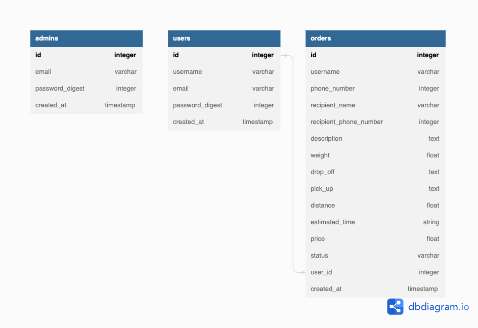
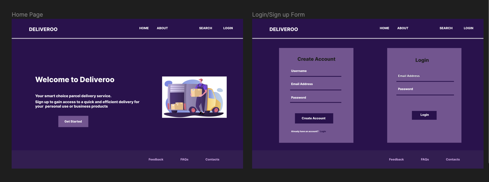
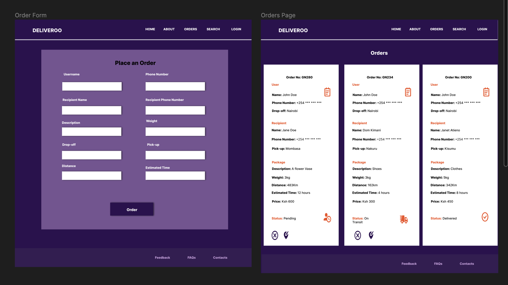
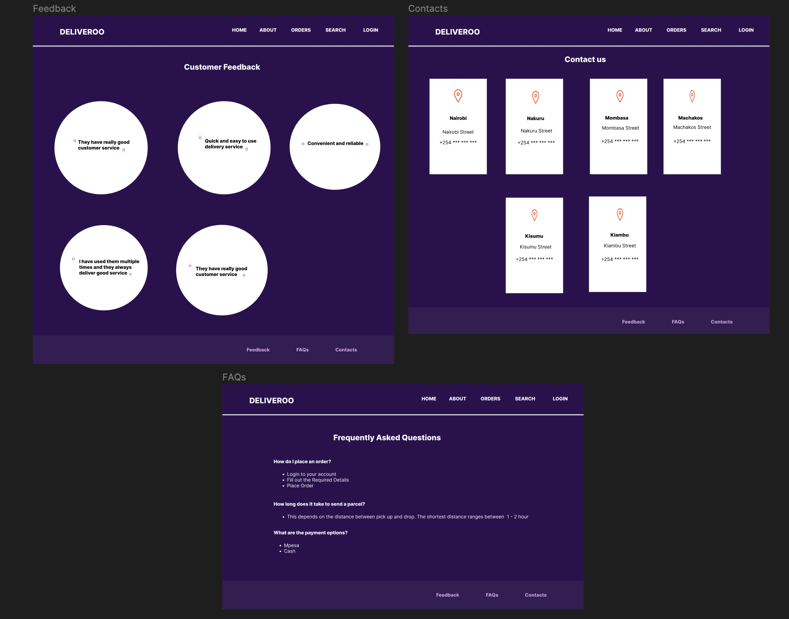

# Phase 5 Project
# Deliveroo

## Table of Content
1. [Project Overview](#project-overview)
2. [Build](#build)
3. [MVP Features](#mvp-features)
    - [Optional Features](#optional-features)
4. [ERD Diagram](#erd-diagram)
5. [Figma Design](#figma-design)
6. [Authors](#author)
7. [License](#license)

## Project Overview
Deliveroo is a courier service that helps users deliver parcels to different destinations. 

## Build
Full Stack - React(Frontend) & Ruby on Rails(Backend)

## MVP Features
1. Users can create an account and log in.
2. Users can create a parcel delivery order.
3. Users can change the destination of a parcel delivery order.
4. Users can cancel a parcel delivery order.
5. Users can see the details of a delivery order.
6. Admin can change the status and present location of a parcel delivery order.
7. The application should display a Google Map with Markers showing the pickup location and the destination.
8. The application should display a Google Map with a line connecting both Markers (pickup location and the destination).
9. The application should display a Google Map with computed travel distance and journey duration between the pickup location and the destination.

### Optional Features
The user gets real-time email notification when Admin changes the status of their parcel.
The user gets real-time email notification when Admin changes the present location their parcel.

NB:
The user can only cancel or change the destination of a parcel delivery when the parcel’s status is yet to be marked as delivered.
Only the user who created the parcel delivery order can cancel the order.

## ERD Diagram

## Figma Design

## Front-end 
Deployment link: https://deliveroo-wine.vercel.app/

## Back-end
Deployment link: https://deliveroo-backend-api.onrender.com/

## Authors
This project was contributed to by:
* [Daryl Mutai](https://github.com/Darylcosm0)
* [Lincoln Kimutai Too](https://github.com/LincKim)
* [Nyokabi Kamau](https://github.com/NyokabiKamau/)
* [Venus Kabera](https://github.com/venus714)
* [Luul Bana](https://github.com/LULAZ7)

## License
* This project is licensed under MIT License