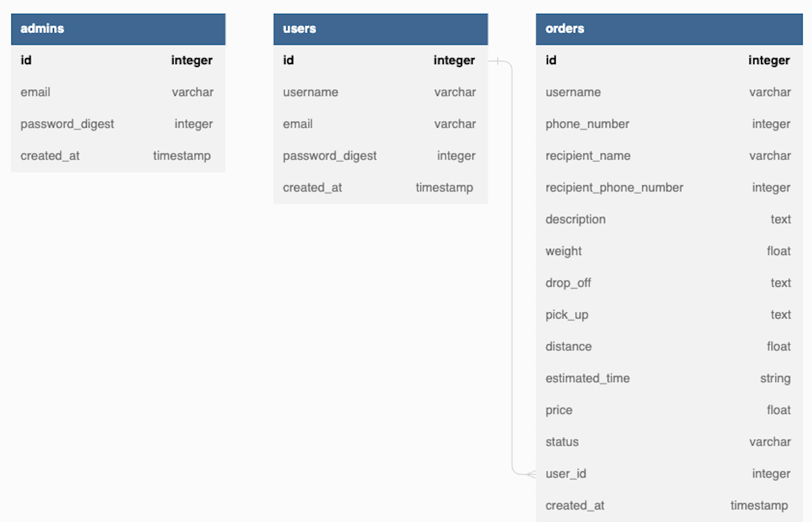

# Phase 5 Project
# Deliveroo


## Table of Content
1. [Project Pre-requisite](#project-pre-requisite)
2. [Project Setup](#project-setup)
3. [Technologies Used](#technologies-used)
4. [Project Overview](#project-overview)
    - [MVP Features](#mvp-features)
    - [Optional Features](#optional-features)
    - [ERD Diagram](#erd-diagram)
    - [Figma Design](#figma-design)
5. [Backend](#back-end)
6. [FrontEnd](#front-end)
7. [Authors](#author)
8. [License](#license)

## Build
Full Stack - React(Frontend) & Ruby on Rails(Backend)


## Project Pre-requisite
In order to use this repository, you will need to have the following setup in your computer.


* `node v0.9.0+`
* `npm 8.15.0+`
* `ruby 2.7.4+`
* `yarn v1.22.19+`

# Project Setup
This section will guide you through setting up and running this repository on your local machine.

* Clone the repository
    ```
    git clone https://github.com/phase-5-group-7/deliveroo
    ```
* To navigate to the deliveroo project folder
    ```
    cd deliveroo
    ```
* To interact with the front-end part of the application, navigate to the `frontend` folder
    ```
    cd frontend
    ```
* To interact with the back-end part of the application, navigate to the `backend` folder
    ```
    cd backend
    ```
## Technologies Used
This application has been built with these technologies:
* Ruby `v2.7.0` 
* React `v18.0`
* GitHub Actions
* GitHub Projects
* Postgres


## Project Overview
Deliveroo is a courier service that helps users deliver parcels to different destinations. 


### MVP Features
1. Users can create an account and log in.
2. Users can create a parcel delivery order.
3. Users can change the destination of a parcel delivery order.
4. Users can cancel a parcel delivery order.
5. Users can see the details of a delivery order.
6. Admin can change the status and present location of a parcel delivery order.
7. The application should display a Google Map with Markers showing the pickup location and the destination.
8. The application should display a Google Map with a line connecting both Markers (pickup location and the destination).
9. The application should display a Google Map with computed travel distance and journey duration between the pickup location and the destination.


### Optional Features
The user gets real-time email notification when Admin changes the status of their parcel.
The user gets real-time email notification when Admin changes the present location their parcel.

NB:
The user can only cancel or change the destination of a parcel delivery when the parcel’s status is yet to be marked as delivered.
Only the user who created the parcel delivery order can cancel the order.


### ERD Diagram



### Figma Design


## Front-end 
Deployment link: https://deliveroo-wine.vercel.app/

If encounter issues when install node packages due to peer dependancies, run the following commands in the `frontend` directory

* Delete the node_modules folder.
    ```
    rm -r node_modules
    ```
* Delete the package-lock.json
    ```
    rm -r package-lock.json
    ```
* Globally install Yarn
    ```
    npm install -g yarn
    ```
* Install the project’s dependencies
    ```
    yarn install
    ```
Now that the project relies on Yarn as a project manager, you will use the command below to start the browser
    ```
    yarn start
    ```

## Back-end
Deployment link: https://deliveroo-backend-api.onrender.com/


## Authors
This project was contributed to by:
* [Daryl Mutai](https://github.com/Darylcosm0)
* [Lincoln Kimutai Too](https://github.com/LincKim)
* [Nyokabi Kamau](https://github.com/NyokabiKamau/)
* [Venus Kabera](https://github.com/venus714)
* [Luul Bana](https://github.com/LULAZ7)


## License
[](https://opensource.org/licenses/MIT)
```
MIT License

Copyright (c) 2023 phase-5-group-7

Permission is hereby granted, free of charge, to any person obtaining a copy
of this software and associated documentation files (the "Software"), to deal
in the Software without restriction, including without limitation the rights
to use, copy, modify, merge, publish, distribute, sublicense, and/or sell
copies of the Software, and to permit persons to whom the Software is
furnished to do so, subject to the following conditions:

The above copyright notice and this permission notice shall be included in all
copies or substantial portions of the Software.

THE SOFTWARE IS PROVIDED "AS IS", WITHOUT WARRANTY OF ANY KIND, EXPRESS OR
IMPLIED, INCLUDING BUT NOT LIMITED TO THE WARRANTIES OF MERCHANTABILITY,
FITNESS FOR A PARTICULAR PURPOSE AND NONINFRINGEMENT. IN NO EVENT SHALL THE
AUTHORS OR COPYRIGHT HOLDERS BE LIABLE FOR ANY CLAIM, DAMAGES OR OTHER
LIABILITY, WHETHER IN AN ACTION OF CONTRACT, TORT OR OTHERWISE, ARISING FROM,
OUT OF OR IN CONNECTION WITH THE SOFTWARE OR THE USE OR OTHER DEALINGS IN THE
SOFTWARE.
```

